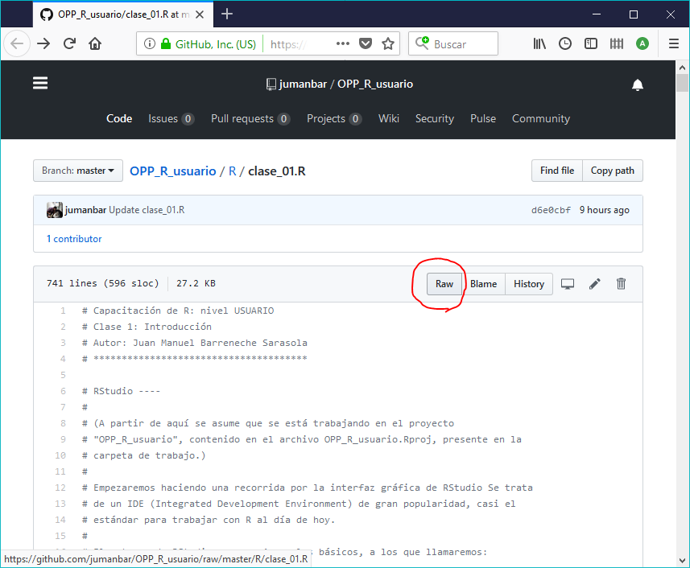
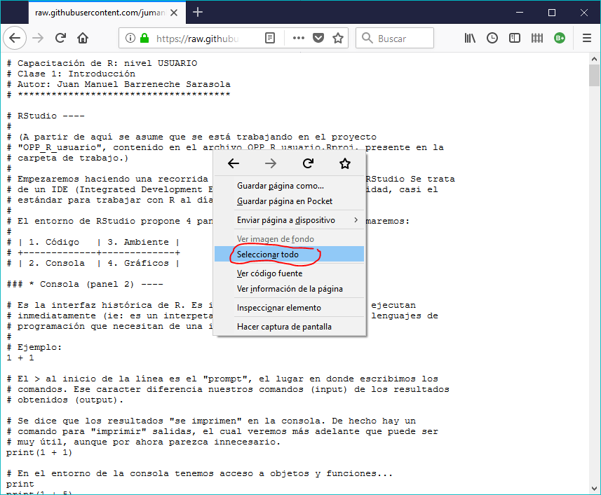
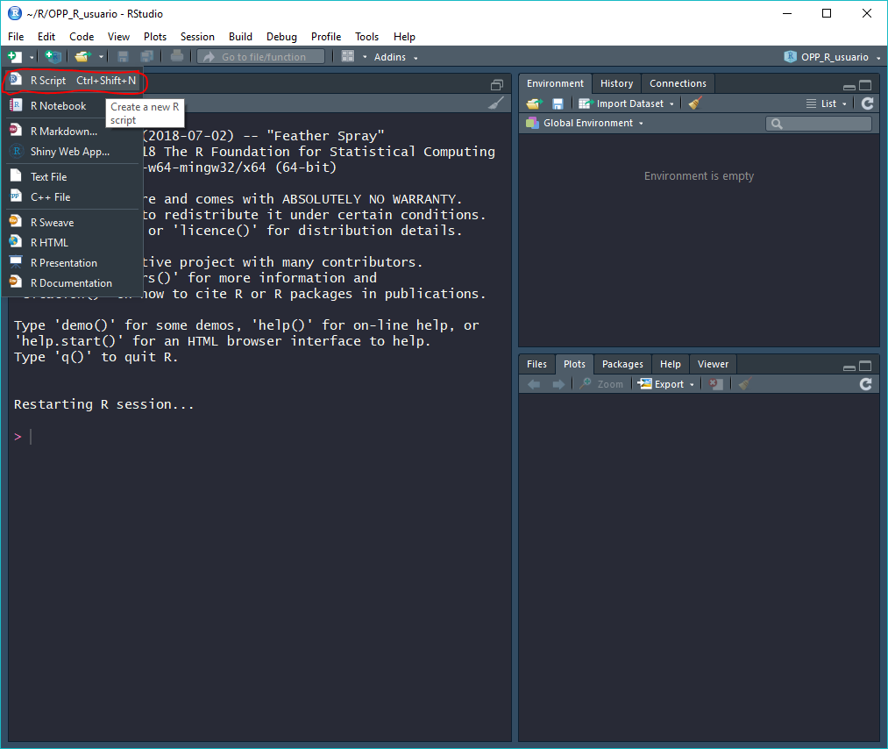
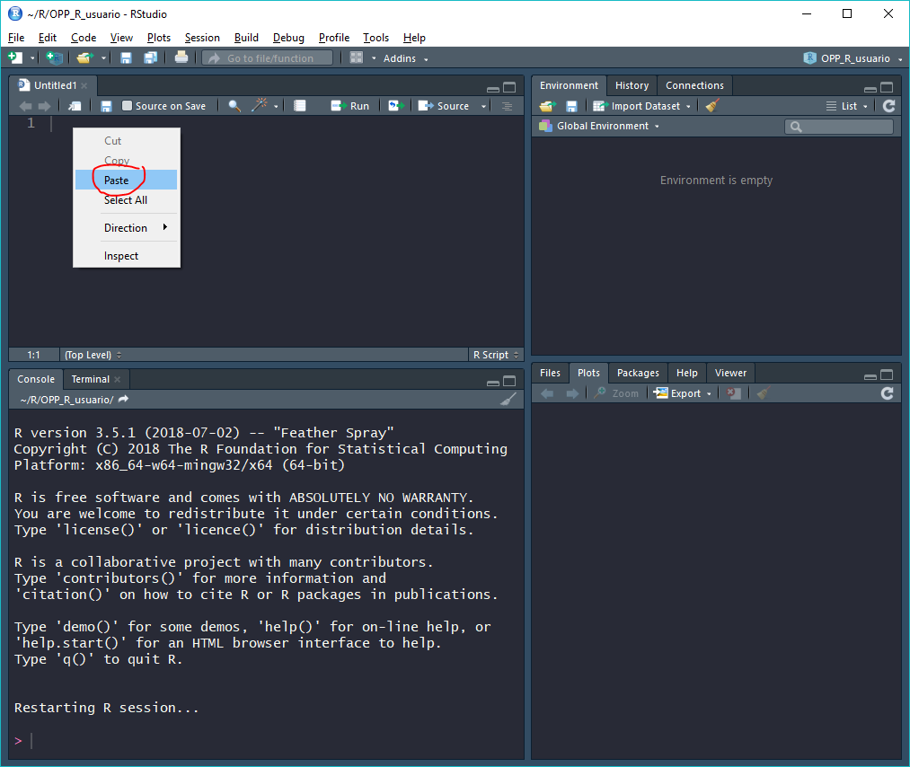
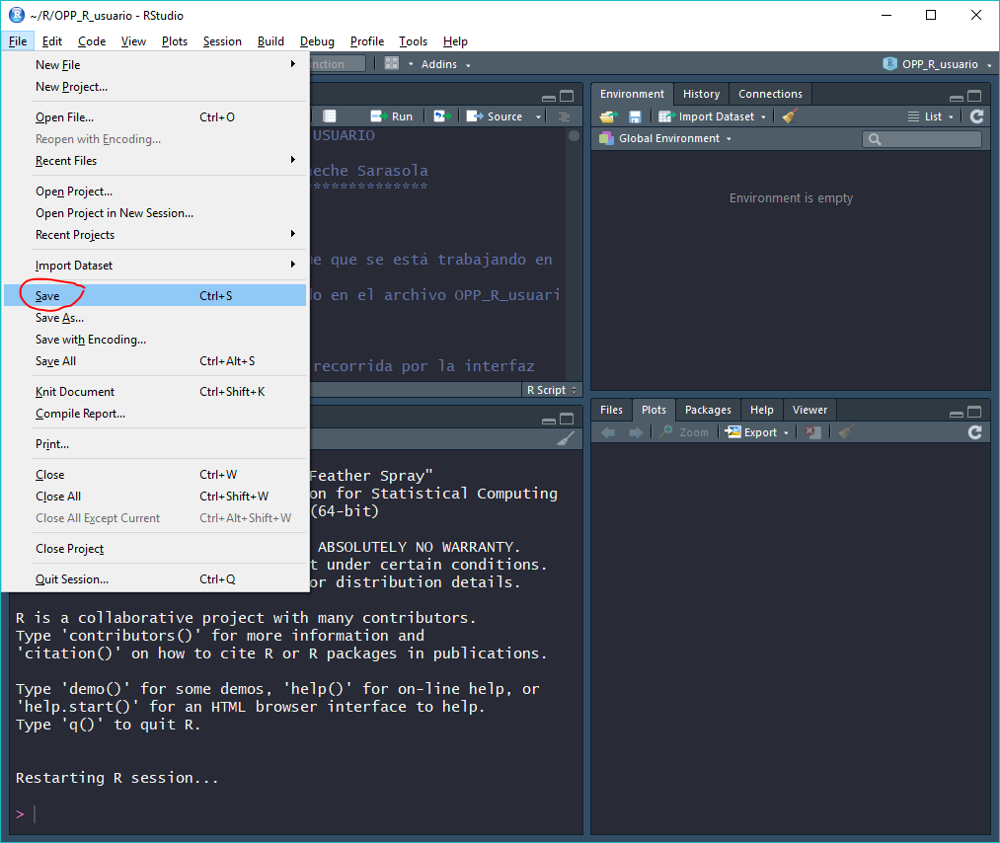
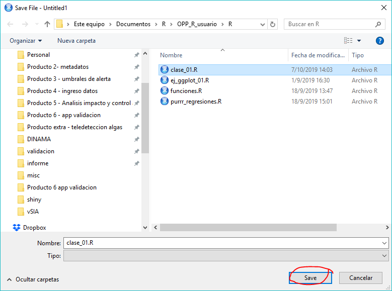
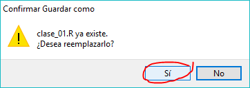

# Código R (y otros)

> Las instrucciones también sirven para archivos:

> .R, .txt, .csv, .Rmd, .md y más...

En esta carpeta se guardan múltiples archivos con comandos escritos en lenguaje R (i.e.: "scripts"). Para guardar archivos individuales, siga los siguientes pasos (aplica también para otros archivos de texto plano, como se indica arriba).

1. Ir al enlace del archivo individual (ejemplo: [clase_01.R](clase_01.R)).  
2. Hacer click en "[Raw](https://raw.githubusercontent.com/jumanbar/OPP_R_usuario/master/R/clase_01.R)", para obtener el código puro.  

3. Apretar el botón derecho del mouse y elegir "seleccionar todo".  

4. Copiar (Ctrl+C o con botón derecho del mouse).  

5. Abrir un nuevo archivo de R con RStudio.  

6. Pegar (Ctrl+V).  

7. Guardar en la carpeta "OPP_R_usuario/R".

