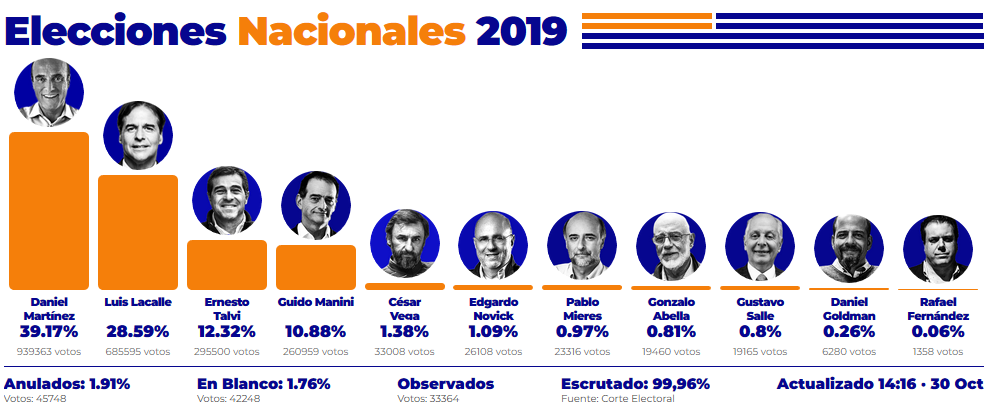

```{r setup, include=FALSE}
knitr::opts_chunk$set(echo = TRUE)
library(tidyverse)
```

## Descripción

Se grafican los resultados de las elecciones primarias del día 27-10-2019, buscando imitar el estilo del [Portal 180](https://www.180.com.uy/):



En el primer paso se genera la tabla con los datos

```{r tabla}

v <- tibble(
  candidato  = c("Martínez", "Lacalle", "Talvi", "Manini", "Vega", "Novick", 
                 "Mieres", "Abella", "Salle", "Goldman", "Fernández"),
  porcentaje = c(39.17, 28.59, 12.32, 10.88, 1.38, 1.09, .97, .81, .8, .26, .06)
)
```


Y a contunación se grafican los valores

```{r pressure, echo=TRUE}
v %>% 
  ggplot() +
  aes(x = fct_inorder(candidato), y = porcentaje) +
  geom_col(fill = "#f57f0a") +
  guides(fill=FALSE) + 
  geom_text(aes(y = porcentaje + 1, label = porcentaje)) +
  ylab("%") + xlab("Candidato") + 
  ggtitle("Primarias 2019", "Domingo 27 de Octubre")

```

Note that the `echo = FALSE` parameter was added to the code chunk to prevent printing of the R code that generated the plot.
