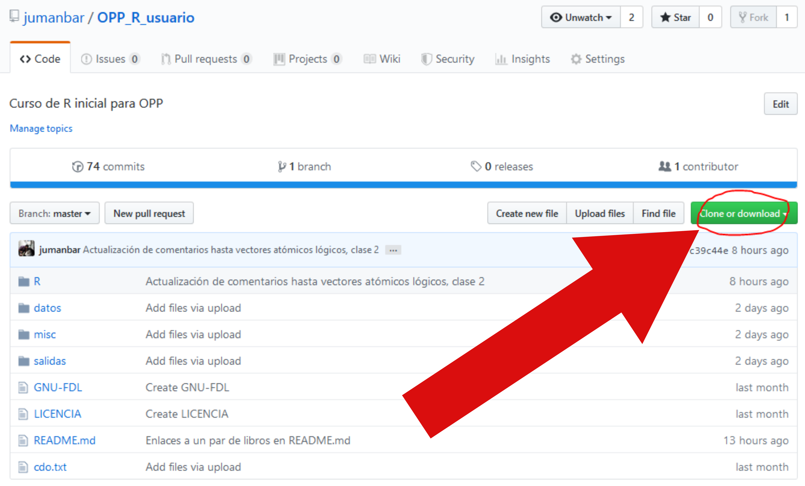

# OPP_R_usuario
Curso de R inicial para OPP

Carpetas:

- [datos](datos/): archivos con datos (texto plano, planillas, RData y más)  
- [R](R/): archivos de código R  
- [salidas](salidas): archivos generados desde R (como gráficos o texto)
- [misc](misc): archivos misceláneos (ej.: capturas de pantalla usados para armar instrucciones)

# ¿Cómo desargar el repositorio completo?

¡Atención! Al descargar el repositorio completo, se incluyen archivos de git, el sistema de control de versiones.

Si lo desea hacer de todas formas, utilice el botón "Clone or Download":

# ¿Cómo descargar/actualizar las clases individuales?

Ver [este tutorial](https://github.com/jumanbar/OPP_R_usuario/blob/master/R/README.md) (aplica para todos los archivos de texto plano, como .txt, .csv, md, etc., presentes en el respositorio).

# ¿Cómo descargar archivos binarios individuales (.pdf, .zip, .RData, etc)?

Pinchar el archivo con el mouse y luego pinchar "view raw". En el menú que aparece, seleccionar "guardar archivo", para descargarlo en la carpeta de descargas por defecto.

# Enlaces y materiales de interés:

- La cuenta de Twitter en la que comparto noticias, materiales, y más: https://twitter.com/imser_

- Repositorio del curso en línea IMSER, cuya última edición fue dada en el año 2013: https://github.com/jumanbar/Curso-R

- Lista de videos de IMSER: https://www.youtube.com/watch?v=b-y3-7wMeco&list=PL41C5vgvqV_PA-e634Q4wn5MKbubqv6P9

- Tidyverse, un conjunto de paquetes con opiniones fuertes: https://www.tidyverse.org/

- R for Data Science, libro online de Garrett Grolemund y [Hadley Wickham](https://en.wikipedia.org/wiki/Hadley_Wickham): https://r4ds.had.co.nz/

- Advanced R, por [Hadley Wickham](https://en.wikipedia.org/wiki/Hadley_Wickham): https://adv-r.hadley.nz/

- Trencitos o "cheatsheets" para varios paquetes de R (de tidyverse): https://www.rstudio.com/resources/cheatsheets/

- Libro de recetas de R (recomiendo especialmente la parte de gráficos con ggplot2): http://www.cookbook-r.com/

- R Inferno: un recorrido por el infierno del R de la mano de Virgilio, quien nos muestra todos los círculos de los pecadores y sus características: https://www.burns-stat.com/pages/Tutor/R_inferno.pdf

- Más tutoriales muy buenos, aunque relativamente viejos, de la página de Patrick Burns: https://www.burns-stat.com/documents/tutorials/
